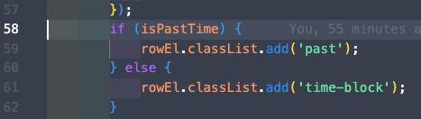
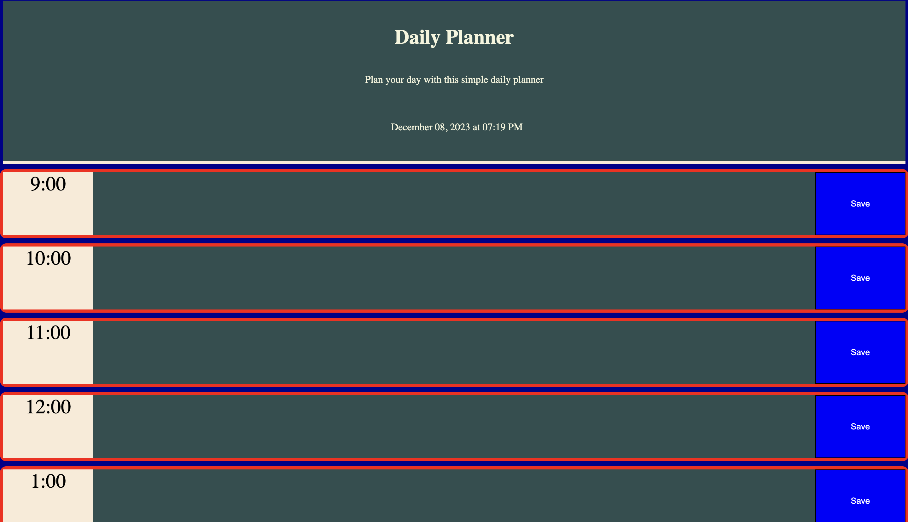
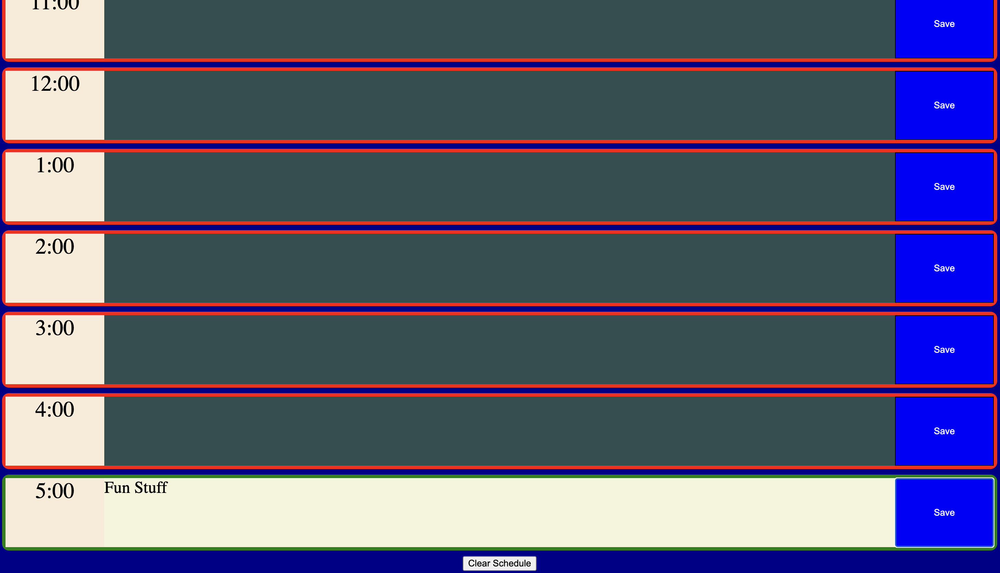

# Daily Planner App
By: Ryan Hanzel

## Links

[GitHub](https://github.com/h3xivall/daily-planner)

[HomePage](https://h3x.cafe/daily-planner)

## Description

A simple daily planner app made with JavaScript that dynamically changes the HTML/CSS. The app utilizes the [DayJS](https://day.js.org/en/) API and saves tasks to the browsers local storage. If the time blocks are in the past they will display dark green and the future blocks are a light color. I implemented a timer that will run so the blocks automatically change color as you move throughout your day. The timer will pause if you click on the task box so you don't lose progress while you are typing and the timer will resume after you hit the save button. If you are done with your day I included a nifty Clear Schedule button at the end of the page that will clear all tasks and local storage.

If you are beyond 5pm and want to test the CSS color change for the blocks you can insert a ! before the isPastTime in the if statement.

## Screenshots

